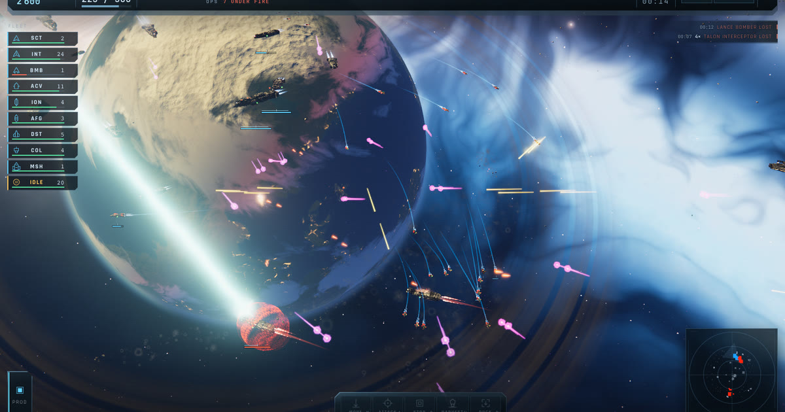

# Starfall

A Homeworld-style, universe-scale space RTS that runs in a browser.

**[▶ Play it](https://e01.ai/starfall/)** · [the prompt it came from](prompt.md) · [build thread](https://x.com/mikeluan123/status/2081716631986983093)



---

Written by **Claude Opus 5** driving a multi-agent workflow, from a single
prompt. No design document, no asset list, no architecture was specified up
front — the prompt is reproduced in full in [`prompt.md`](prompt.md).

First run: **~$633** — 68.6k input tokens, 4.6M output, 837.2M cache read,
13.6M cache write.

## There are no image files

Not one, anywhere in the build. Every hull, texture, planet, star field, nebula
and effect is generated at runtime from code:

- **Hulls** are lofted from authored cross-sections, then dressed by a
  budget-driven pass that spends its remaining triangle allowance on plate
  steps, greebles, catwalks and window rows sampled off the lofted skin. A
  density field decides where detail must be *absent*, because the difference
  between a warship and a noise field is that a warship has quiet armour to
  contrast against its machinery.
- **Surfaces** are triplanar procedural detail at three scales — armour blocks,
  plating, rivets — with the tile size scaling to hull radius, so a 2.1 km
  mothership is not panelled in the same 6 m plates as a 27 m interceptor.
- **Planets** are fBm noise with an atmosphere shell; the sky is a procedural
  nebula baked to a cube map, which then feeds the PMREM environment lighting,
  so the ships are genuinely lit by the sky they sit in.

The only imported assets are audio, and all of it is CC0 — see the in-game
credits (**CREDITS** in the top bar, or <kbd>F1</kbd>).

## What is in it

- **Thirteen ship classes**, from a scout to a two-kilometre mothership
- **Three-dimensional movement** with the Homeworld move disc: right-drag
  vertically to dial the altitude of an order
- Formations, stances, control groups, a fleet roster bar, band select and
  hull-accurate picking
- Production, research, resource harvesting and an opponent AI
- Drive plumes with shock diamonds, wakes that curve through a manoeuvre, ion
  lances, kinetic tracers, shields and multi-stage detonations
- A streamed score that follows the intensity of the fight

## Running it

```bash
npm install
npm run build     # tsc --noEmit && vite build
npm run preview   # serves dist on :4173
```

Needs a browser with WebGL 2.

## How it is put together

Contract-first, so the subsystems could be built independently:

| Path | Responsibility |
|---|---|
| `src/core/types.ts` | Every shared shape — Ship, Order, Projectile, GameEvents |
| `src/core/contracts.ts` | Module interfaces, the geometry attribute contract, LOD budgets, shared GLSL |
| `src/core/registry.ts` | The thirteen ship classes: hardpoints, engine mounts, costs, research |
| `src/sim/` | Fixed 60 Hz simulation over a pooled entity store and a spatial hash |
| `src/ships/` | Procedural hull generation |
| `src/render/` | Instanced fleet renderer, hull material, camera rig, picking |
| `src/fx/` | Weapons, drives, explosions, particles |
| `src/ui/` | HUD, production panel, fleet bar, menu |
| `scripts/` | Headless verification harnesses — screenshots, probes, gesture tests |

Rendering is decoupled from simulation and never mutates it. Ships draw through
one `InstancedMesh` per (class, LOD, variant) bucket plus impostor billboards at
range, so a fleet of hundreds holds frame rate.

`scripts/` is worth a look if you are curious how a model verifies its own
visual work: `capture.mjs` drives a headless browser and shoots frames,
`probe.mjs` evaluates arbitrary expressions against the live scene, `pnginfo.mjs`
reads histograms back out of the screenshots, and `inputtest.mjs` measures what
each mouse gesture actually did to the camera. Almost every fix in the history
was found with one of them rather than by reasoning about the code.

## Credits

In tribute to **Homeworld** (Relic Entertainment, 1999) — the game that decided
a fleet should be a shape in three dimensions, that a wake should tell you which
way a contact is breaking, and that silence and a horizon line are worth more
than any amount of noise. Starfall is an independent homage and uses none of its
art, audio, code or trademarks.

The prompt is a modified version of [Matt Shumer](https://x.com/mattshumer_)'s
one-shot AAA prompt.

Music from [OpenGameArt](https://opengameart.org) (Tozan, yd, wipics, vitalezzz,
Synth-thetic, CleytonKauffman); sound effects from
[Kenney](https://kenney.nl). All CC0.

Built with [three.js](https://threejs.org), [Vite](https://vite.dev) and
[TypeScript](https://www.typescriptlang.org).

By [Mike Luan](https://x.com/mikeluan123) at [e01.ai](https://e01.ai/).

## Licence

[MIT](LICENSE).
